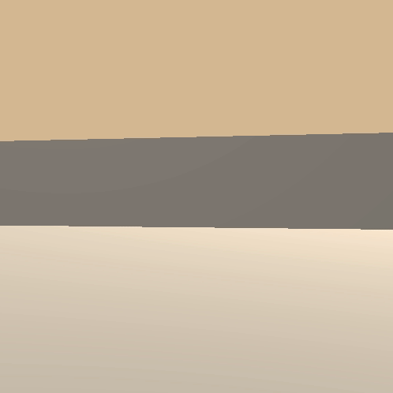
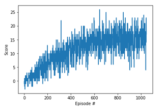

## Project 1: Navigation

### Introduction

For this project, an agent is trained to navigate for yellow bananas (for collection) in a large square world.

|Agent before training|Agent After training|
|:-:|:-:|
|||


A sample exmple of the evolution of the rewards along the episodes is as follows:




+1 of reward is provided when a yellow banana is collected, while -1 of penalty is given when a blue banana is collected.

The goal of the training is to have your agent collect as many yellow bananas as possible, avoiding blue bananas as much as possible.  

The dimension of the state space is 37, containing the agent's velocity along with a ray-based perception of objects around the agent's forward direction. With this information, the agent learns how to choose optimal actions. 

There are four actions available as follows:

- **`0`** - moving forward
- **`1`** - moving backward
- **`2`** - turning left
- **`3`** - turning right

Your agent is supposed to obtain a mean score above 13 (may take more than 100 episodes for that). In this project, it is possible to solve the project in fewer than 1800 episodes. The task is episodic, and in order to solve the environment, your agent must get an average score of +13 over 100 consecutive episodes.


### Getting Started

Reference: https://github.com/udacity/deep-reinforcement-learning/blob/master/p1_navigation/README.md

1. Download the environment from one of the links below.  You need only select the environment that matches your operating system:
    - Linux: [click here](https://s3-us-west-1.amazonaws.com/udacity-drlnd/P1/Banana/Banana_Linux.zip)
    - Mac OSX: [click here](https://s3-us-west-1.amazonaws.com/udacity-drlnd/P1/Banana/Banana.app.zip)
    - Windows (32-bit): [click here](https://s3-us-west-1.amazonaws.com/udacity-drlnd/P1/Banana/Banana_Windows_x86.zip)
    - Windows (64-bit): [click here](https://s3-us-west-1.amazonaws.com/udacity-drlnd/P1/Banana/Banana_Windows_x86_64.zip)
    
    (_For Windows users_) Check out [this link](https://support.microsoft.com/en-us/help/827218/how-to-determine-whether-a-computer-is-running-a-32-bit-version-or-64) if you need help with determining if your computer is running a 32-bit version or 64-bit version of the Windows operating system.

    (_For AWS_) If you'd like to train the agent on AWS (and have not [enabled a virtual screen](https://github.com/Unity-Technologies/ml-agents/blob/master/docs/Training-on-Amazon-Web-Service.md)), then please use [this link](https://s3-us-west-1.amazonaws.com/udacity-drlnd/P1/Banana/Banana_Linux_NoVis.zip) to obtain the environment.

2. Place the file in the DRLND GitHub repository, in the `p1_navigation/` folder, and unzip (or decompress) the file.

3. (Note) The following repository contains material related to Udacity's [Deep Reinforcement Learning Nanodegree](https://www.udacity.com/course/deep-reinforcement-learning-nanodegree--nd893) program. Refer to the dependencies below if needed!

Reference: https://github.com/udacity/deep-reinforcement-learning/blob/master/README.md

#### Dependencies

To set up your python environment to run the code in this repository, follow the instructions below.

1. Create (and activate) a new environment with Python 3.6.

	- __Linux__ or __Mac__: 
	```bash
	conda create --name drlnd python=3.6
	source activate drlnd
	```
	- __Windows__: 
	```bash
	conda create --name drlnd python=3.6 
	activate drlnd
	```
	
2. Follow the instructions in [this repository](https://github.com/openai/gym) to perform a minimal install of OpenAI gym.  
	- Next, install the **classic control** environment group by following the instructions [here](https://github.com/openai/gym#classic-control).
	- Then, install the **box2d** environment group by following the instructions [here](https://github.com/openai/gym#box2d).
	
3. Clone the repository (if you haven't already!), and navigate to the `python/` folder.  Then, install several dependencies.
```bash
git clone https://github.com/udacity/deep-reinforcement-learning.git
cd deep-reinforcement-learning/python
pip install .
```

4. Create an [IPython kernel](http://ipython.readthedocs.io/en/stable/install/kernel_install.html) for the `drlnd` environment.  
```bash
python -m ipykernel install --user --name drlnd --display-name "drlnd"
```

5. Before running code in a notebook, change the kernel to match the `drlnd` environment by using the drop-down `Kernel` menu. 


### Instructions

Getting started - follow the instructions in `Navigation.ipynb` to begin with training your own agent!